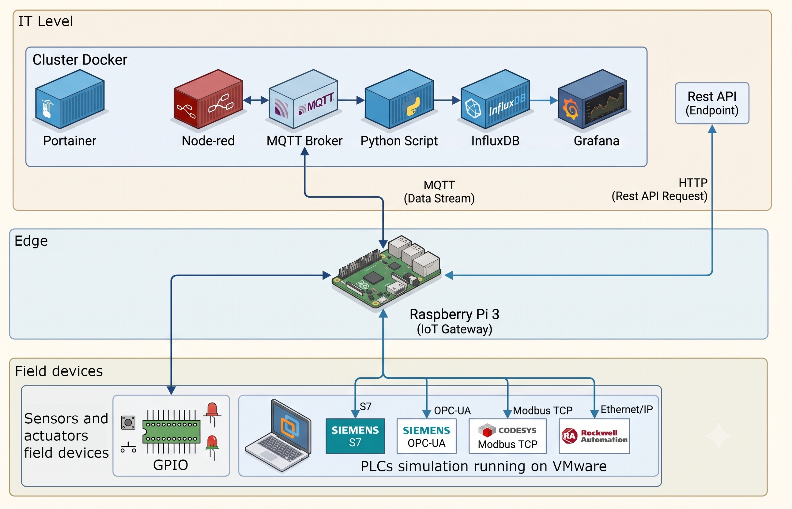
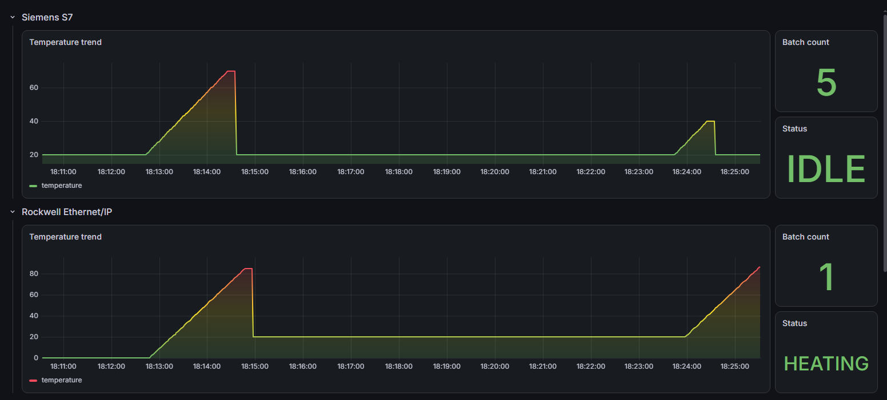
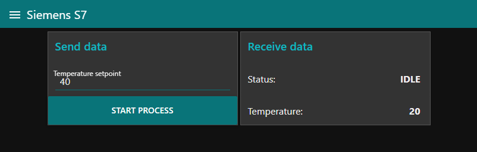
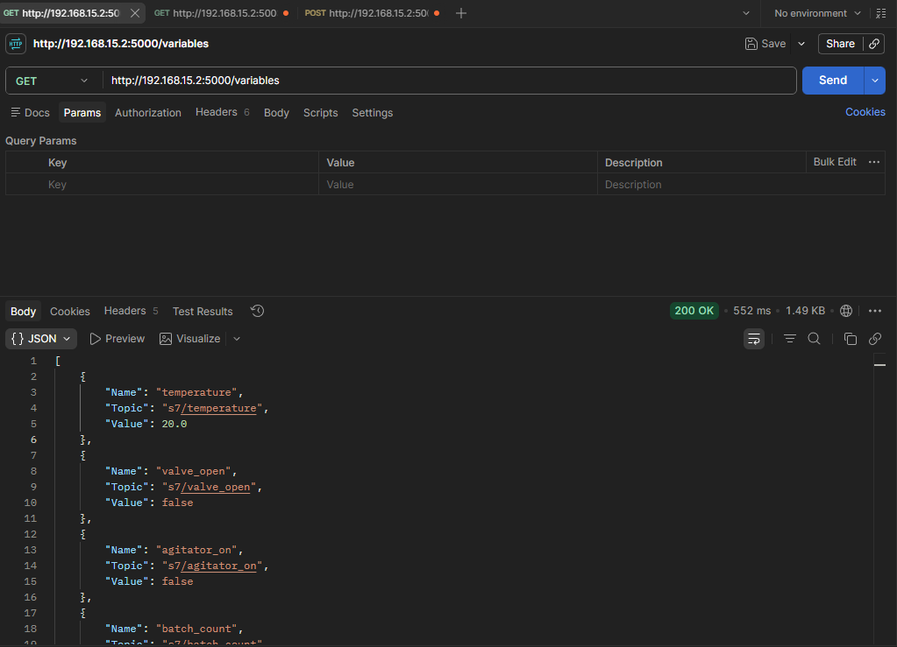

# homelab-automation

A self-study project applying Linux, Docker, and multi-protocol industrial communication to build a small IT/OT integration stack end to end: from simulated PLCs in the field to a live monitoring dashboard.

## Motivation

I work daily with PLC and HMI development for machine manufacturing (Siemens TIA Portal, Rockwell Studio 5000, COPA-DATA Zenon). This repository is where I extend that experience into areas I touch less often in my day-to-day role: Linux system administration, Docker-based infrastructure, and connecting multiple industrial protocols into a single IT/OT data pipeline. It is a personal learning project, not professional work, but every part of it runs and was tested against real (simulated) PLCs.

## Architecture

The repository simulates the three classic levels of an industrial automation stack:

*   **Field**: PLCs running in simulation inside a VMware instance (Siemens, CODESYS, and Rockwell), and GPIO for real digital I/O on the Raspberry Pi itself.
*   **Edge**: a Raspberry Pi 3 acting as a multi-protocol IoT gateway, running the Python/C (Project 01 is Python, and Project 02 is C) collector in this repository.
*   **IT / Cloud**: a Docker stack (running on a Windows host) with Portainer, Node-RED, an MQTT broker (Mosquitto), a custom Python subscriber, InfluxDB, and Grafana, plus a REST API exposed directly from the edge device.

The gateway supports Siemens S7, Rockwell EtherNet/IP, Modbus TCP (CODESYS), OPC-UA, and GPIO. All protocols can run concurrently on the same device, each configured independently.

## Projects

<table><tbody><tr><td>Project</td><td>Description</td></tr><tr><td><a href="project-00-setup/">project-00-setup</a></td><td>Docker cloud stack (Portainer, InfluxDB, Grafana, Mosquitto, Node-RED, MQTT-to-InfluxDB subscriber) and Raspberry Pi base setup.</td></tr><tr><td><a href="project-01-multiprotocol-python/">project-01-multiprotocol-python</a></td><td>Python multi-protocol IoT gateway: connects to Siemens S7, Rockwell EtherNet/IP, Modbus TCP, OPC-UA, and GPIO, and publishes to MQTT and a REST API.</td></tr><tr><td><a href="project-02-multiprotocol-c/">project-02-multiprotocol-c</a></td><td>The same gateway reimplemented from scratch in C, working directly against each protocol's native library instead of a high-level automation framework, with the same MQTT and REST API surface.</td></tr></tbody></table>

Each project folder has its own README with detailed setup and configuration instructions.

## Dashboard

Live data from all three simulated PLCs (Siemens, Rockwell, CODESYS) and GPIO, visualized in Grafana via InfluxDB.

## Operator screen (Node-RED)

Node-RED runs as the front-end/operation terminal, subscribing to the same MQTT data stream used by the historian.

## REST API

The edge device also exposes a REST API to read and write variables directly, independent of the MQTT stream. The example above shows the `GET /variables` route returning all configured variables; the API also supports `GET /variable/<topic>` for a single variable and `POST /write` to write a value. Both the Python and the C implementation expose the same three routes; full details are documented in each project's own README (project-01, project-02).

## Status and roadmap

This project is under active development.

**Done:**

*   Docker cloud stack: Portainer, InfluxDB, Grafana, Mosquitto, Node-RED, and a custom MQTT-to-InfluxDB subscriber.
*   Python multi-protocol gateway: Siemens S7, Rockwell EtherNet/IP, Modbus TCP, OPC-UA, and GPIO, all running concurrently on a single Raspberry Pi 3.
*   C multi-protocol gateway: the same five protocols reimplemented from scratch in C, directly against each protocol's native library, with its own connection manager, MQTT bridge, and REST API, running on the same hardware.
*   MQTT publish/subscribe and a REST API (read and write) on the edge device, in both implementations.
*   Grafana dashboards per protocol.

**Next:**

*   Structured, persistent local logging on the Raspberry Pi (replacing console output).